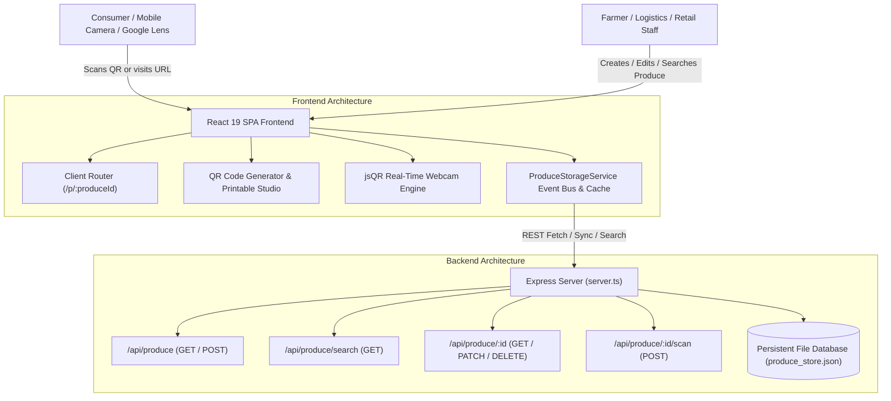

# 🌿 Aurbana — Fresh Produce Digital Identity Platform

[](https://aurbana.vercel.app/)
[](https://github.com/shanmukhdatta/Aurbana)

> 🌐 **Live Vercel Web Application**: [https://aurbana.vercel.app/](https://aurbana.vercel.app/)  
> 📄 **Live Digital Passport Example**: [https://aurbana.vercel.app/p/AUR-2026-TOM-8F42K](https://aurbana.vercel.app/p/AUR-2026-TOM-8F42K)
>
> **Production-Grade AgriTech Supply Chain Transparency System**
>
> Give every harvest batch a verified digital identity. Track fresh produce from farm gate to customer kitchen table using dynamically generated, ISO-compliant scannable QR tags and real-time ledger search.

---

## 📋 Table of Contents

- [Overview](#-overview)
- [Tech Behind & Architecture](#-tech-behind--architecture)
- [Key Features](#-key-features)
- [Database & REST API Reference](#-database--rest-api-reference)
- [QR Code Scanning & Google Lens Guide](#-qr-code-scanning--google-lens-guide)
- [Getting Started & Local Setup](#-getting-started--local-setup)
- [Production Build & Deployment](#-production-build--deployment)
- [License & Support](#-license--support)

---

## 🌟 Overview

In traditional agricultural supply chains, fresh produce changes hands up to **6 times** before reaching consumer tables, resulting in severe opacity regarding harvest age, farm origin, storage conditions, and quality grades.

**Aurbana** solves this problem by assigning a cryptographically structured **Digital Produce Passport** (e.g. `AUR-2026-TOM-8F42K`) to every batch of vegetables, fruits, and leafy greens. Each passport is paired with an ISO-compliant QR code that can be scanned by any smartphone camera app, Google Lens, or in-browser scanner.

---

## 🛠️ Tech Behind & Architecture

Aurbana is engineered as a unified, high-performance TypeScript web application combining a React 19 single-page interface with an Express backend persistence layer.

### Technical Architecture Diagram



### Core Technologies

- **Frontend Core**: React 19, TypeScript 5.8, Vite 6
- **Styling & Motion**: Vanilla CSS custom design system, TailwindCSS 4, Motion (Framer), Lucide Icons
- **Backend Server**: Node.js, Express 4, `tsx` TypeScript runner, `esbuild` production bundler
- **Persistence & Database**: Server-side JSON storage (`produce_store.json`) with auto-seeding, file persistence, and client-side `localStorage` cache with subscriber event-bus
- **QR Code Engine**: `qrcode` generator producing **ISO/IEC 18004 compliant** PNG and SVG vector outputs with High (`H`) error correction level and 4-module quiet zone
- **Real-Time Scanner**: `jsQR` frame-by-frame HTML5 canvas video matrix reader with produce ID normalizer

---

## 🚀 Key Features

### 1. Digital Produce Passport (`/p/:produceId`)
- View certified harvest age, freshness index gauge, farm origin, quality condition, and inspector notes.
- Explore step-by-step cold chain transit timeline.
- Review lab residue test scores, Brix sweetness index, and nutritional highlights.
- Interactive authenticity verification seal and consumer freshness feedback ratings.

### 2. Digital Identity Creator (`/create`)
- Register new produce batches with automated ID generation (`AUR-YYYY-CODE-TOKEN`).
- Pre-built produce presets for common crops (Tomato, Mango, Carrot, Spinach, etc.).
- Input detailed metadata: harvest date, collection date, batch number, quantity, storage temperature, and quality notes.
- Immediate database persistence and real-time state broadcast across all active views.

### 3. High-Contrast QR & Vector Tag Studio (`/qr-management`)
- Batch-generate scannable QR codes for registered harvests.
- Download high-resolution PNGs or resolution-independent SVG vector files for printing.
- Select multi-up sticker layouts (`4-up`, `8-up`, `12-up`) for thermal label printers (Zebra, Brother, Dymo) or desktop A4 adhesive sheets.

### 4. Real-Time Database Search & Central Ledger (`/records`)
- Search across produce name, Aurbana ID, farm origin, master grower, or batch number.
- Filter by condition (`Excellent`, `Good`, `Average`, `Poor`) or status (`Active`, `Deactivated`, `Delivered`).
- Sort by date registered, harvest age, or total QR scan count.
- In-place modal editing for updating batch storage locations, inspector notes, and active status.

### 5. In-Browser Webcam Scanner (`/scan`)
- Live camera viewfinder scanning via `jsQR` with laser target overlay.
- Camera switching (environment / user facing camera).
- Fallback manual ID / produce search bar connected directly to database query API.

---

## 🗄️ Database & REST API Reference

All produce records are stored on the server in `produce_store.json` and served over REST endpoints.

| Method | Endpoint | Description |
| :--- | :--- | :--- |
| `GET` | `/api/health` | Server status check, environment, and total record count |
| `GET` | `/api/produce` | Fetch all produce records sorted by recency |
| `GET` | `/api/produce/search?q=QUERY` | Search produce database by keyword (ID, name, farm, batch) |
| `GET` | `/api/produce/:id` | Get single produce record by normalized Aurbana ID |
| `POST` | `/api/produce` | Create or update a produce identity record in `produce_store.json` |
| `POST` | `/api/produce/:id/scan` | Increment scan counter for a produce record |
| `PATCH` | `/api/produce/:id` | Partial update of produce record properties |
| `DELETE` | `/api/produce/:id` | Delete/deactivate a produce record |

### Database Record Schema

```json
{
  "id": "prod-1740000000000-abc12",
  "produce_id": "AUR-2026-TOM-8F42K",
  "produce_name": "Tomato",
  "variety": "Roma Vine-Ripened",
  "category": "Vegetable",
  "age_days": 2,
  "condition": "Excellent",
  "origin": "Green Valley Farm, Punjab",
  "supplier_name": "Green Valley Agri-Cooperative",
  "farmer_name": "Harpreet Singh",
  "harvest_date": "2026-08-22",
  "collection_date": "2026-08-23",
  "registration_date": "2026-08-24",
  "batch_number": "BATCH-2026-TOM-114",
  "quantity": "450 kg (18 crates)",
  "storage_location": "Cold Zone A (12°C)",
  "notes": "Firm texture, deep natural color, hand-picked in early morning mist.",
  "image_url": "https://images.unsplash.com/photo-1592924357228-91a4daadcfea",
  "status": "Active",
  "created_at": "2026-08-24T00:00:00.000Z",
  "updated_at": "2026-08-24T00:00:00.000Z",
  "scan_count": 42,
  "grade": "Grade A+",
  "shelf_life_days": 10
}
```

---

## 📷 QR Code Scanning & Google Lens Guide

### Why QR Scanning Standard Matters

Generic QR generators often omit standard margins or use low-contrast colors, preventing optical camera algorithms (like Google Lens or native iOS/Android camera apps) from identifying the QR bounding box.

### Aurbana Scannability Specifications

1. **ISO/IEC 18004 Quiet Zone**: All generated QR codes enforce a mandatory **4-module quiet zone margin** (`margin: 4`), isolating the finder patterns from borders and backgrounds.
2. **100% High Contrast**: Rendered with pure black modules (`#000000`) on pure white background (`#FFFFFF`), ensuring high readability even under low-light or thermal print conditions.
3. **High Error Correction (`Level H`)**: Up to 30% of the QR code area can be damaged or covered while remaining 100% scannable.
4. **URL & Direct ID Support**: QR codes encode full HTTP URLs (`http://<host>/p/AUR-YYYY-CODE-TOKEN`). Scanning from mobile devices, Google Lens, or the built-in webcam scanner instantly navigates to the public passport page.

---

## 💻 Getting Started & Local Setup

### Prerequisites

- **Node.js** v18.0.0 or higher
- **npm** or **bun** package manager

### Step-by-Step Installation

1. **Clone or Navigate to the Workspace Directory**:
   ```bash
   cd Aurbana
   ```

2. **Install Dependencies**:
   ```bash
   npm install
   ```

3. **Start Development Server**:
   ```bash
   npm run dev
   ```
   *The Express server + Vite middleware will start on `http://localhost:3000`.*

4. **Access Application**:
   - Main Web Application: `http://localhost:3000`
   - Produce Passport Example: `http://localhost:3000/p/AUR-2026-TOM-8F42K`
   - API Health Check: `http://localhost:3000/api/health`

---

## 📦 Production Build & Deployment

To prepare the application for production grade deployment:

1. **Run TypeScript Check & Linter**:
   ```bash
   cmd /c npm run lint
   ```

2. **Build Production Assets**:
   ```bash
   cmd /c npm run build
   ```
   *This compiles the Vite React frontend into `dist/` and bundles `server.ts` into `dist/server.cjs` via `esbuild`.*

3. **Run Production Server**:
   ```bash
   npm start
   ```
   *Runs `node dist/server.cjs` on `PORT=3000` (or custom `process.env.PORT`).*

---

## 📄 License & Support

Developed for **Aurbana AgriTech Supply Chain Solutions**.
For technical inquiries, farmer partnerships, or custom RFID/QR hardware integrations, visit the **Contact Page** inside the application.
